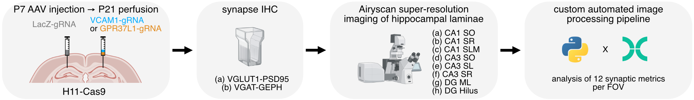

# Multi-metric high throughput synapse analysis

This repository documents the complete workflow for **hippocampal lamina-resolved, multi-metric synapse analysis** following **CRISPR/Cas9-mediated KO of VCAM1 or GPR37L1**.  

<p align="center">
    
</p> 

The repo covers both the **custom multi-metric high throughput image processing pipeline** and **downstream data analyses** within a reproducible environment.


### Repository Structure
```
synapse-counting/
├─- docs/
├── hpc/ # all hpc related scripts and outputs
├── notebooks/ # all scripts for setting parameters before pipeline execution & downstream analyses
| ├── 01_in-vitro_VCAM1-gRNA_QC.R  # Analysis of the VCAM1-gRNA QC in astrocyte culture
| ├── 02_lmem_residuals_pca.R  # Residuals of synaptic metrics to account for brain-to-brain variability and PCA
| ├── 03_lmem_residuals_heatmap.ipynb  # Hierachical clustering of residuals and heatmap plotting
| ├── 04_lmem.R  # to formally test for differences in synaptic metrics between gRNA conditions
| ├── 05_heatmap_lmem.ipynb  # plotting the Log2 FC in a heatmap across synaptic metrics x hippocampal laminae
| ├── 06_plot_single_metric.R  # plotting of single synaptic metric
| ├── handcrafted_parameters.ipynb # empirically setting the preprocessing parameters per synapse type and hippocampal lamina
│ └── local-peaks-epoch.ipynb # to check the local peak maxima parameter optimization across N runs
├── pipeline/
| ├── bin/ # scripts used in the pipeline
| ├── nextflow.config # config file for nextflow pipeline
| ├── optimization_param_ranges_local_peaks_202511.json # used as input for the pipeline and empirically setted in `handcrafted_parameters.ipynb`
| ├── preprocess_params_202511.json # used as input for the pipeline and and empirically setted in `handcrafted_parameters.ipynb`
│ └── run-pipeline.nf # main pipeline script
├── synapse_counting/ # Python package used in the pipeline
├── Dockerfile # used for the pipeline
└── synapse-counting-env.yml # Conda env used for the pipeline and downstream analysis
```

## Custom multi-metric high throughput image processing pipeline

The custom high-throughput image processing pipeline is implemented in the `pipeline/` directory and orchestrated using **Nextflow**.  
Detailed documentation on pipeline execution, configuration, and parameterization can be found within that directory.

## Downstream data analysis

### Dependencies

**R-based data analyses** were performed inside a **reproducible Docker development container** `notebooks/devcontainer/` in Visual Studio Code. Please see the [documentation](https://github.com/RamiKrispin/vscode-r) for more info.

**Python-based analyses** were performed inside a **reproducible Conda environment**, defined in `synapse-counting-env.yml`

### Analysis workflows

`notebooks/01_in-vitro_VCAM1-gRNA_QC.R`

Quality control of VCAM1 gRNAs in astrocyte culture:

1. Normalization to LacZ-gRNA#1

2. Test normality of the data 

3. ANOVA with Dunnet's posthoc test

4. Generate the barplot

`notebooks/02_lmem_residuals_pca.R`

Correction for brain-to-brain variability and dimensionality reduction:

1. Wrangle data

2. Apply linear mixed effects modeling to account for brain-to-brain variability

3. PCA on these residuals

4. Generate the PCA plot

`notebooks/03_lmem_residuals_heatmap.ipynb`

Clustering of synaptic metrics:

1. Import data from script 02

2. Wrangle data

3. Hierachical clustering of the synaptic metrics & plotting in heatmap

`notebooks/04_lmem.R`

Formal statistical testing of synaptic metrics:

1. Wrangle data 

2. Apply linear mixed effects modeling to test for differences in synaptic metrics 

3. Posthoc tests 

4. FDR adjusted per synaptic metric across hippocampal laminae

`notebooks/05_heatmap_lmem.ipynb`

Visualization of statistical results:

1. Import data from script 04

2. Wrangle data

3. Generate heatmap of synaptic metrics x hippocampal laminae

`notebooks/06_plot_single_metric.R`

Single-metric visualization:

1. Wrangle data 

2. Plot for a single metric the data 