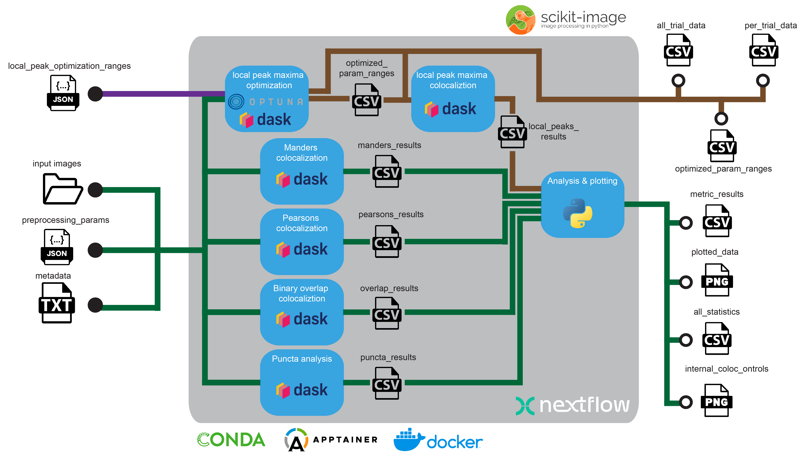

# Automated synapse image processing and analysis pipeline

**synapse-counting** is a Nextflow pipeline for processing and analyzing high-zoom images from immunostained synapses. It takes as input ZEISS Airyscan images (.czi format), preprocessing parameters, parameter ranges for local peak detection, and other parameters necessary for analyzing synapses. When these parameters are set the pipeline will process the imaging data. A custom python package was also developed based on existing scikit-image functions but tailored towards synapse analysis.

    

  

## Pipeline summary

## Usage
### Image data
In our case the image was gathered as below: 

CRISPR-Exp4_IHC-Exp2_Brain-4_section-1_488-VGLUT1_647-PSD95_LacZ-gRNA_63X&3XzoomAiryscan_CA1_SLM.czi

### Preprocessing parameters

### Parameter ranges

### Other input parameters

## Pipeline output

## Dependencies
The pipeline can be run inside a Conda environment or a Docker image. Apptainer can also pull the docker image from DockerHub.

## Limitations
The pipeline can only be used for ZEISS image format (.czi).
