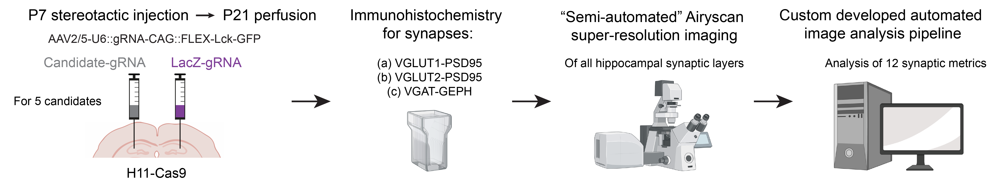

# Automated synapse image processing and analysis pipeline

**synapse-counting** is a Nextflow pipeline for processing and analyzing immunostained synapses from high-zoom images. It takes as input ZEISS Airyscan images (.czi format), preprocessing parameters, parameter ranges for local peak detection, and other parameters necessary for analyzing synapses. When these parameters are set the pipeline will process the imaging data. A custom python package was also developed based on existing scikit-image functions but tailored towards synapse analysis.

    

  

## Pipeline summary
The pipeline will analyze 12 synapse metrics with 5 processes, 4 metrics assess colocalization and 8 metrics assess the pre- and postsynaptic puncta, these metrics include the following:
1. Local peak maxima colocalization: this first optimizes the parameters for detecting local peak maxima's using 90 degrees rotated post-synapse image as comparison using the Optuna library. Then, these parameters are used to calculate 
2. Regular Mander's Coefficient colocalization
3. Pearsons correlation Coefficient colocalization
4. Regular pixel overlap after binarization of the images
5. Puncta analysis: pre- and postsynapse mean fluorescence intensity (MFI)
6. Puncta analysis: pre- and postsynaptic puncta density per 100 um2
7. Puncta analysis: pre- and postsynaptic staining area
8. Puncta analysis: pre- and postsynaptic puncta size

Python scripts were parallelized with Nextflow, in each script the image data was parallelized using Dask.

## Usage
In our case the image was gathered as below: 

    

  

## Input
### Image data

CRISPR-Exp4_IHC-Exp2_Brain-4_section-1_488-VGLUT1_647-PSD95_LacZ-gRNA_63X&3XzoomAiryscan_CA1_SLM.czi

### Preprocessing parameters

### Parameter ranges

### Other input parameters

## Pipeline output

## Dependencies
The pipeline can be run inside a Conda environment or a Docker image. Apptainer can also pull the docker image from DockerHub.

## Limitations
The pipeline can only be used for ZEISS image format (.czi).
