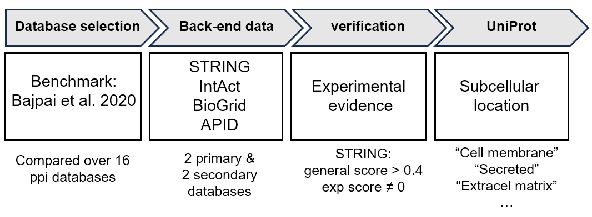

# In silico protein-protein interactions 
With this script you can collect all the known interactions of a human or mouse protein from the following databases: [BioGRID](https://thebiogrid.org/), [STRING](https://string-db.org/), [IntAct](https://www.ebi.ac.uk/intact/home) & [APID](http://cicblade.dep.usal.es:8080/APID/init.action). You can find the script under the folder biogridStrinIntactApid/. 

### How to use
Requirments in conda environment: `ppi-env.yml`

### Database selection  
Describe here your reasoning for database selection. Reference to other papers.
There is no real consensus which database to use. 

### What is does

### Background to script development
Which APIs that you use. Omnipath first, refer to issue.